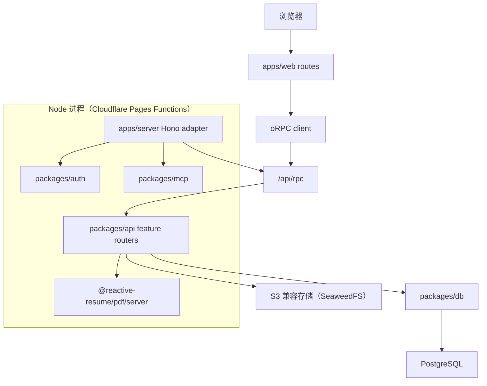

<Warning>
  本文档面向**开发者**，涵盖项目架构、部署设计、构建流程与国际化方案。
</Warning>

---

## 一、项目概述

Craftisle Resume 是一个注重隐私的在线简历构建工具，免费、开源、可自部署。

| 项目属性 | 说明 |
|-----------|------|
| 仓库地址 | `https://github.com/yysam123456-source/craftisle-resume` |
| 技术栈 | React 19 + TanStack Router + Vite 8 + Tailwind CSS 4 + Lingui i18n |
| 服务端 | Hono + Better Auth + Drizzle ORM + oRPC |
| 部署平台 | Cloudflare Pages（前端）+ Docker（服务端基础设施）|
| Package Manager | pnpm 11 + Turborepo monorepo |
| 自定义域名 | `resume.craftisle.com` |

---

## 二、架构设计

### Monorepo 结构

```
craftisle-resume/
├── apps/
│   ├── web/                # 前端（TanStack Router + React）
│   └── server/             # 服务端（Hono + oRPC）
├── packages/
│   ├── api/                # oRPC 过程与业务逻辑
│   ├── auth/               # Better Auth 配置
│   ├── db/                 # Drizzle schema + migrations
│   ├── pdf/                # React PDF 渲染（浏览器 + 服务端）
│   ├── docx/               # DOCX 导出
│   ├── mcp/                # MCP tools/prompts/resources
│   ├── resume/             # 简历数据逻辑（Patch、schema）
│   ├── schema/             # Zod schemas + 类型
│   ├── ui/                 # 共享 UI 组件（shadcn 风格）
│   ├── ai/                 # AI provider 类型与提示词
│   ├── import/             # 简历导入（PDF/DOCX/JSON）
│   ├── fonts/              # 字体元数据
│   ├── email/              # 邮件模板与传输
│   └── utils/              # 跨包工具函数
├── tooling/                # 开发脚本与工具
├── migrations/             # 数据库迁移文件
└── docs/                   # Mintlify 文档站点
```

### 运行时架构



### 包职责边界

| Workspace | 职责 |
|-----------|------|
| `apps/web` | TanStack Router 路由、Web 功能、浏览器 PDF.js 预览、PWA、oRPC 浏览器客户端 |
| `apps/server` | Hono 路由组合、生产 HTTP 适配器、MCP 传输、OpenAPI、静态文件服务 |
| `packages/api` | oRPC procedures、按 `src/features/*` 组织的业务逻辑 |
| `packages/auth` | Better Auth 配置、认证 helpers |
| `packages/db` | Drizzle 客户端与 schema、`migrations/` 目录 |
| `packages/pdf` | React PDF 文档、模板原语、字体注册、浏览器/服务端生成适配器 |
| `packages/schema` | Zod schemas、类型化的简历/页面/模板模型 |
| `packages/resume` | 纯简历领域 helpers（JSON Patch 行为、network icon mapping）|
| `packages/mcp` | MCP tools、prompts、resources、server card、工具元数据 |
| `packages/ui` | 共享 Base UI/shadcn 风格原语与 hooks |
| `packages/ai` | AI provider 类型、prompts、简历解析/清洗 helpers |
| `packages/import` | 简历导入器（PDF/DOCX/JSON）|
| `packages/fonts` | 字体元数据 |
| `packages/email` | 邮件传输与模板 |
| `packages/utils` | 窄粒度跨包工具函数，显式 export 子路径 |
| `tooling` | 仅开发脚本与仓库工具 |

### 边界规则

- 使用 `@reactive-resume/*` package exports 进行跨 workspace 导入
- **不要**通过 `apps/**`、`packages/**`、`@reactive-resume/*/src/**` 导入，也不要通过 TypeScript path alias 导入其他 workspace 的 `src`
- 浏览器专用代码放在 web features 或显式 browser 子路径
- 服务端专用代码放在 server packages 或显式 server 子路径
- 环境无关的领域包不包含 DB、HTTP、DOM 或 app 导入
- 审慎添加 public package exports，通配符 exports 仅保留给 leaf 风格的 public surfaces（如 UI 组件/hooks、schema 简历文件）

检查命令：
```bash
pnpm exec turbo boundaries
pnpm exec biome check biome.json turbo.json tooling/grit/no-cross-workspace-src-imports.grit \
  apps/web/tsconfig.json apps/*/turbo.json packages/*/turbo.json
```

---

## 三、部署方案

### 3.1 Cloudflare Pages（生产部署）

| 配置项 | 值 |
|--------|-----|
| **Build command** | `pnpm install && pnpm --filter web build` |
| **Build output** | `apps/web/dist` |
| **Node.js version** | 22.x（由 `packageManager` 字段控制）|
| **Postbuild** | `node ../../scripts/generate-seo-pages.js`（自动执行）|
| **自定义域名** | `resume.craftisle.com` |

#### 构建日志关键检查点

每次部署后，检查 Cloudflare Pages 构建日志是否包含：

```
✅ Found 55 .mjs files                          ← compile-locales.js 正确找到源文件
✅ en-US.mjs → public/locales/en-US.json (863 messages)  ← 消息数量正确
✓ 19322 modules transformed.                      ← Vite 构建成功
✅ Generated 64 static SEO pages in dist/           ← postbuild 成功
```

#### 构建流程（CI 中执行）

```bash
# 1. pnpm install（安装依赖）
# 2. pnpm --filter web build
#    2a. node scripts/compile-locales.js  → 生成 public/locales/*.json
#    2b. rm -rf dist && vite build     → 生成 dist/
# 3. postbuild: node ../../scripts/generate-seo-pages.js
#    → 生成 dist/templates/[profession].html（60 页）
#    → 生成 dist/guides/[slug].html（4 页）
```

### 3.2 .gitignore 策略

| 文件 | 是否提交 Git | 原因 |
|------|--------------|------|
| `apps/web/locales/*.po` | ✅ 是 | 翻译源文件，人工编辑 |
| `apps/web/locales/*.mjs` | ✅ 是 | `lingui compile` 产物，提交以绕过 CI 中 `lingui compile` 编译 0 个 catalog 的问题 |
| `apps/web/locales/*.js` | ❌ 否 | 旧格式，已被 `.gitignore` 排除 |
| `apps/web/public/locales/*.json` | ❌ 否 | 构建时生成，`.gitignore` 排除 |
| `apps/web/dist/` | ❌ 否 | 构建产物，`.gitignore` 排除 |

### 3.3 CDN 缓存问题排查

如果构建成功但线上翻译不生效：

1. 用 `curl` 验证线上 JSON：
   ```bash
   curl -s https://resume.craftisle.com/locales/en-US.json | \
     python3 -c "import json,sys; d=json.load(sys.stdin); print(len(d))"
   # 应输出 863
   ```

2. 如果条数正确但翻译仍不生效，清除 Cloudflare CDN 缓存：
   - 进入 Cloudflare Dashboard → Caching → Configuration
   - 点击 **Purge Everything**

### 3.4 Cloudflare Managed Content 问题

Cloudflare 的 "Content Scraping Protection" 会注入 `robots.txt` 规则屏蔽 AI 爬虫（ClaudeBot、GPTBot 等）。

**检测**：
```bash
curl -s https://resume.craftisle.com/robots.txt | grep -i "disallow"
```

**修复**（需手动操作）：
1. 登录 [dash.cloudflare.com](https://dash.cloudflare.com)
2. 选择 `rumorcraftisle` 站点
3. **Security → Settings → Content Scraping Protection** → 关闭

关闭后，线上 `robots.txt` 才会返回仓库中的版本（允许所有爬虫）。

---

## 四、构建流程

### 4.1 本地开发

```bash
# 依赖安装
corepack enable
pnpm install

# 启动基础设施（PostgreSQL + Redis + SeaweedFS）
docker compose -f compose.dev.yml up -d postgres redis seaweedfs seaweedfs_create_bucket

# 配置环境变量（创建 .env 文件）
# 启动开发服务器
pnpm dev
# → http://localhost:3000
```

### 4.2 本地生产构建

```bash
cd apps/web

# 完整构建（推荐）
pnpm run build
# 等价于：
# 1. node scripts/compile-locales.js  → 生成 public/locales/*.json
# 2. rm -rf dist && vite build    → 生成 dist/

# 单独步骤（调试用）
pnpm lingui:compile          # 生成 locales/*.mjs
node scripts/compile-locales.js  # 生成 public/locales/*.json
pnpm vite build              # 生成 dist/
```

### 4.3 `compile-locales.js` 详解

该脚本将 Lingui 编译后的 `.mjs` 文件转换为浏览器运行时加载的 `.json` 文件。

**核心逻辑**：
```js
const module = await import(mjsPath);  // 动态导入 .mjs
const messages = module.messages;
writeFileSync(jsonPath, JSON.stringify(messages, null, 2));
```

**为什么 `.mjs` 文件要提交到 Git？**

`lingui compile` 在 Cloudflare Pages CI 环境中**有时会编译 0 个 catalog**（根因未完全定位）。解决方案是将 `.mjs` 文件提交到仓库，CI 构建时直接读取，不再依赖 `lingui compile` 在 CI 中正确执行。

### 4.4 构建产物验证

```bash
# 验证 JSON 消息数量
cat apps/web/public/locales/en-US.json | \
  python3 -c "import json,sys; print(len(json.load(sys.stdin)))"
# 应输出 863

# 验证关键消息 ID 存在
cat apps/web/public/locales/en-US.json | \
  python3 -c "import json,sys; d=json.load(sys.stdin); print('R2Xqfp' in d)"
# 应输出 True
```

---

## 五、i18n 方案

### 5.1 技术栈

- **框架**：`@lingui/react`（运行时 i18n）
- **格式**：`.po` 文件（翻译源）+ `.mjs`（编译后）+ `.json`（浏览器运行时）
- **语言数量**：55 种
- **配置**：`apps/web/lingui.config.ts`

### 5.2 完整工作流


### 5.3 添加新翻译字符串

#### ✅ 正确流程

1. 在源码中使用 `<Trans>` 或 `t()`：
   ```tsx
   // 带显式 ID（推荐，ID 稳定）
   <Trans id="preview-changes-btn">Preview Changes</Trans>

   // 不带显式 ID（ID 由 Lingui 自动 hash）
   <Trans>Preview Changes</Trans>
   ```

2. **必须运行** `lingui extract`：
   ```bash
   cd apps/web
   pnpm run lingui:extract
   ```
   这会把新字符串提取到 `locales/*.po` 文件。

3. 提交 `.po` 文件（翻译可以稍后补全，英文原文已写入 `.po`）。

4. 运行完整构建验证：
   ```bash
   pnpm run build
   # 检查 dist/locales/en-US.json 是否包含新消息 ID
   ```

#### ❌ 常见错误

| 错误 | 后果 | 修复 |
|------|------|------|
| 修改 `<Trans>` 文本后不运行 `lingui extract` | 新消息不在 `.po` 中，运行时显示消息 ID（如 `R2Xqfp`）| 运行 `lingui extract` 并重新构建 |
| 只提交 `.po`，不提交 `.mjs` | CI 构建时使用旧的 `.mjs`，新翻译不生效 | 本地运行 `lingui compile` 后提交 `.mjs` 文件 |
| `compile-locales.js` 读取 `.js` 而非 `.mjs` | 读到旧格式文件，消息缺失 | 检查脚本是否优先读取 `.mjs` |
| 直接解析 `.po` 文件生成 JSON | `.po` 的 `msgid` 是英文原文，不是消息 ID，导致所有翻译查找失败 | 必须通过 `lingui compile` 生成 `.mjs`，再转换为 `.json` |

### 5.4 消息 ID 机制

Lingui 的消息 ID 有两种来源：

**1. 自动生成（默认）**

Lingui 对英文原文计算 hash，如：
```
"Preview Changes" → ID: "R2Xqfp"
```

- 优点：原文改动时 ID 自动更新
- 缺点：开发时不知道 ID 是什么，调试不便

**2. 显式 ID（推荐用于 UI 关键文本）**

```tsx
<Trans id="preview-changes-btn">Preview Changes</Trans>
```

`.po` 文件中：
```
msgctxt "explicit-id"
msgid "preview-changes-btn"
msgstr "Preview Changes"
```

- 优点：ID 稳定，易于在代码中引用和调试

### 5.5 `lingui.config.ts` 关键配置

```ts
export default defineConfig({
  sourceLocale: "en-US",
  locales: [/* 55 种语言 */],
  fallbackLocales: {
    default: "en-US",
  },
  format: poFormatter({ lineNumbers: false }),
  compileNamespace: "es",  // 输出 .mjs（ES Module）
  catalogs: [
    {
      path: "<rootDir>/locales/{locale}",
      include: ["src"],
    },
  ],
});
```

### 5.6 故障排查

#### 界面显示消息 ID（如 `R2Xqfp`）

**根因**：运行时加载的 JSON 中没有该消息 ID。

**排查步骤**：
1. 检查 `.po` 文件是否包含该字符串的翻译
2. 运行 `lingui extract` 确保新字符串被提取
3. 运行 `lingui compile` 重新生成 `.mjs`
4. 运行 `compile-locales.js` 重新生成 `.json`
5. 提交 `.mjs` 文件到 Git

#### `lingui compile` 在 CI 中编译 0 个 catalog

**临时解决方案**：将 `.mjs` 文件提交到 Git（已实现）。

**长期修复**：需要定位为什么 `<rootDir>` 在 Cloudflare Pages CI 中解析不正确。可能需要在 `lingui.config.ts` 中使用绝对路径，或在 CI 构建命令中显式 `cd` 到正确目录。

#### 构建日志显示 `Found 0 .mjs files`

**根因**：`compile-locales.js` 过滤了错误的文件扩展名。

**修复**：确保脚本优先读取 `.mjs`：
```js
const mjsFiles = readdirSync(localesDir).filter((f) => f.endsWith(".mjs"));
```

---

## 六、程序化 SEO 方案

### 6.1 静态 SEO 页面生成

`scripts/generate-seo-pages.js` 在 `postbuild` 阶段执行，生成静态 HTML 文件供 AI 爬虫读取。

**生成内容**：
- `dist/templates/[profession].html`（60 个职业模板页）
- `dist/guides/[slug].html`（4 个指南页）

**数据来源**：
- 职业数据：`apps/web/src/libs/seo/professions.ts`（40 个职业）
- 指南数据：预定义在 `apps/web/src/routes/guides/$slug.tsx` 中

### 6.2 SPA 爬虫问题

React SPA 的 DOM 由 JS 动态生成，AI 爬虫不执行 JS 就看不到内容。

**当前方案**（临时）：
- `index.html` 的 `<div id="app">` 内写静态 loading spinner
- 完整的 SEO 内容放在 `<noscript>` 标签内（JS 用户看不到，无 JS 的爬虫能看到）

**完整修复**（待实施）：
- 预渲染或 SSR（TanStack Router 的 SSR 能力）
- 或用 Cloudflare Worker 对 bot UA 返回预渲染 HTML

---

## 七、广告功能

### 7.1 Monetag Vignette 广告

**概述**：使用 Monetag Vignette（插页式广告）作为主广告，脚本硬编码在根布局中。

| 属性 | 值 |
|------|-----|
| 脚本 URL | `https://n6wxm.com/vignette.min.js` |
| Zone ID | `11117037` |
| 加载位置 | `apps/web/src/routes/__root.tsx` → `RootComponent()` → `useEffect()` |
| 触发时机 | 应用首次加载或页面刷新（F5）|
| SPA 路由跳转 | 不重复触发（Vignette 设计如此）|

**开关逻辑**（`VITE_PUBLIC_ADVER_ENABLE` 环境变量）：

```tsx
const adEnable = (import.meta.env.VITE_PUBLIC_ADVER_ENABLE || "true") === "true";

if (!adEnable) return;  // false = 不展现广告
// true = 展现广告（默认）
```

| `VITE_PUBLIC_ADVER_ENABLE` 值 | 结果 |
|--------------------------------|---------|
| 未设置（Cloudflare 没配置） | ✅ 默认 `"true"`，广告展现 |
| `"true"` | ✅ 广告展现 |
| `"false"` | ❌ 广告不展现 |

**硬编码说明**：

Monetag 脚本 URL 和 Zone ID 已硬编码到 `__root.tsx`，未在 Cloudflare Pages 环境变量中配置，原因：
1. 减少环境变量配置项
2. 避免环境变量读取失败导致广告不加载

**Cloudflare Pages 环境变量配置**（只需配置 AdSense 相关）：

```
VITE_PUBLIC_ADVER_ENABLE=true        # 可选，默认 true
VITE_ADSENSE_CLIENT_ID=ca-pub-xxxxx # AdSense 发布商 ID（可选）
```

**注意**：修改环境变量后需点击 **"Retry deployment"** 重新部署。

### 7.2 广告组件（AdSense）

- **组件文件**：`apps/web/src/components/ads/index.tsx`
- **组件**：`AdBanner`（横幅广告）、`AdCard`（卡片广告）
- **控制开关**：通过 `import.meta.env.VITE_ADSENSE_CLIENT_ID` 判断是否开启（非独立变量）

**核心实现逻辑**：

```tsx
// isAdsenseConfigured() — 判断是否配置 AdSense
function isAdsenseConfigured(): boolean {
  const env = (import.meta as { env?: Record<string, string> }).env;
  return !!env?.VITE_ADSENSE_CLIENT_ID;
}
```

- `VITE_ADSENSE_CLIENT_ID` 存在 → 广告开启，渲染真实 AdSense 广告
- `VITE_ADSENSE_CLIENT_ID` 不存在 → 生产环境返回 `null`（不渲染）；本地开发环境返回占位符

**AdSense 脚本加载**（按需加载，去重）：

```tsx
function useAdsenseScript(): boolean {
  // 1. 检查 clientId 是否存在
  // 2. 检查 document.querySelector('script[src*="adsbygoogle"]') 是否已存在
  // 3. 不存在则动态创建 script 标签，src = `https://pagead2.googlesyndication.com/pagead/js/adsbygoogle.js?client=${clientId}`
  // 4. script.async = true, script.crossOrigin = "anonymous"
}
```

**SSR 兼容处理**：

- 所有 `window`、`document` 访问都在 `useEffect` 或条件判断中进行
- `typeof window !== "undefined"` 检查确保在 SSR 环境下不报错
- `adsbygoogle.push()` 在 `try/catch` 中执行，避免 AdSense 未加载时崩溃

### 7.3 广告位布局

| 页面 | 广告位置 | 尺寸 | 组件 |
|------|---------|------|--------|
| Home 页 | 顶部（header 下方）| leaderboard (728×90) | `AdBanner size="leaderboard"` |
| Home 页 | 底部（footer 上方）| leaderboard (728×90) | `AdBanner size="leaderboard"` |
| Dashboard 页 | 简历列表上方 | leaderboard (728×90) | `AdBanner size="leaderboard"` |
| Builder 页 | 右侧 sidebar 底部 | rectangle (300×250) | `AdBanner size="rectangle"` |
| Footer | 上方（所有页面）| leaderboard (728×90) | `AdBanner size="leaderboard"` |

**支持的广告尺寸**（`sizeMap`）：

```tsx
const sizeMap = {
  leaderboard: { width: 728, height: 90 },
  rectangle: { width: 300, height: 250 },
  skyscraper: { width: 160, height: 600 },
  responsive: { width: "100%", height: "auto" },
} as const;
```

### 7.4 开启广告的完整步骤

**前置条件**：需要有效的 Google AdSense 账号（需通过审核）

**步骤 1：申请 Google AdSense 账号**

1. 访问 [adsense.google.com](https://adsense.google.com)
2. 使用 Google 账号登录，提交网站 `https://resume.craftisle.com`
3. 等待审核（通常 1-14 天）
4. 审核通过后，获取 **发布商 ID**（`ca-pub-xxxxxxxxxxxxx`）

**步骤 2：获取广告位 ID（Ad Slot ID）**

1. 在 AdSense 控制台创建广告单元
2. 选择广告尺寸（728×90 leaderboard / 300×250 rectangle）
3. 获取 **广告位 ID**（`data-ad-slot` 的值）

**步骤 3：配置 Cloudflare Pages 环境变量**

1. 登录 [dash.cloudflare.com](https://dash.cloudflare.com)
2. 进入 **Pages** → **craftisle-resume** 项目
3. **Settings** → **Environment variables**
4. 添加以下变量：

| 变量名 | 说明 | 示例值 |
|---------|------|----------|
| `VITE_ADSENSE_CLIENT_ID` | AdSense 发布商 ID（必须）| `ca-pub-1234567890` |
| `VITE_ADSENSE_SLOT_LEADERBOARD` | 728×90 广告位 ID（可选）| `1234567890` |
| `VITE_ADSENSE_SLOT_RECTANGLE` | 300×250 广告位 ID（可选）| `1234567891` |
| `VITE_ADSENSE_SLOT_SKYSCRAPER` | 160×600 广告位 ID（可选）| `1234567892` |

5. 点击 **Save and deploy** → 触发重新构建

**步骤 4：验证广告显示**

1. 等待部署完成（约 2-3 分钟）
2. 访问 `https://resume.craftisle.com`
3. 打开浏览器开发者工具 → **Network** 标签
4. 刷新页面，检查是否有 `adsbygoogle.js` 加载
5. 广告位是否显示（灰色占位符 → 真实广告）

**本地开发预览**：

在 `apps/web/.env.local` 中添加：

```bash
VITE_ADSENSE_CLIENT_ID=ca-pub-test-12345
VITE_ADSENSE_SLOT_LEADERBOARD=test-slot-123
```

本地启动 `pnpm dev` 后，广告位会显示占位符（`Advertisement · leaderboard`），不会加载真实广告。

### 7.5 广告平台选择

| 平台 | 申请条件 | RPM（每千次展示收入）| 支付方式 | 推荐度 |
|-------|----------|----------------------|---------|--------|
| **Google AdSense** | 需 50+ 篇文章或一定流量，审核严格 | $0.5 ~ $3 | 支票/电汇/ Western Union | ⭐⭐⭐（有流量首选）|
| **Media.net** | 需 5000+ 月 PV | $1 ~ $2 | PayPal/电汇 | ⭐⭐（流量达标后）|
| **Adsterra** | 无流量门槛，申请简单 | $0.1 ~ $1 | 加密货币/PayPal | ⭐（初期过渡）|
| **PropellerAds** | 无流量门槛 | $0.1 ~ $0.5 | PayPal/Payoneer | ⭐（补充）|

**推荐策略**：

1. **建站初期**（< 5000 PV/月）：使用 **Adsterra**，无门槛，快速上线
2. **流量增长后**（> 5000 PV/月）：申请 **Media.net**
3. **流量稳定后**（> 10000 PV/月）：申请 **Google AdSense**（收益最高）

### 7.6 故障排查

| 问题 | 可能原因 | 排查步骤 |
|-------|----------|----------|
| 广告位空白 | `VITE_ADSENSE_CLIENT_ID` 未配置 | 检查 Cloudflare Pages 环境变量是否存在 |
| 广告位空白 | AdSense 审核未通过 | 登录 AdSense 控制台查看账户状态 |
| 广告位显示 "Advertisement" 占位符 | 本地开发环境，未配置真实 ID | 正常行为，生产环境配置后会显示真实广告 |
| `adsbygoogle.js` 加载失败 | 网络问题 / AdBlock 拦截 | 检查浏览器控制台，关闭 AdBlock 测试 |
| 广告显示后不久消失 | AdSense 检测到无效流量 | 检查流量来源，避免刷量 |

---

## 九、文件清单

### i18n 相关

| 文件 | 作用 | 是否提交 Git |
|------|------|--------------|
| `apps/web/locales/*.po` | 翻译源文件（人工编辑）| ✅ 是 |
| `apps/web/locales/*.mjs` | `lingui compile` 产物 | ✅ 是 |
| `apps/web/locales/*.js` | 旧格式（已废弃）| ❌ 否（.gitignore）|
| `apps/web/public/locales/*.json` | 运行时加载的 JSON（构建时生成）| ❌ 否（.gitignore）|
| `apps/web/lingui.config.ts` | Lingui 配置 | ✅ 是 |
| `apps/web/scripts/compile-locales.js` | .mjs → .json 转换脚本 | ✅ 是 |

### 构建相关

| 文件 | 作用 |
|------|------|
| `apps/web/package.json` | 构建脚本定义 |
| `apps/web/vite.config.ts` | Vite 构建配置 |
| `apps/web/index.html` | SPA 入口 HTML（含 SEO fallback）|
| `apps/web/public/_headers` | Cloudflare Pages 响应头配置 |
| `scripts/generate-seo-pages.js` | 静态 SEO 页面生成脚本 |

---

## 十、更新记录

| 日期 | 变更 |
|------|------|
| 2026-06-08 | 初始版本，基于实际调试经验编写 |
| 2026-06-08 | 确定 `.mjs` 提交到 Git 的方案，绕过 CI 中 `lingui compile` 问题 |
| 2026-06-08 | 添加 Monetag Vignette 广告（https://n6wxm.com/vignette.min.js, zone=11117037），硬编码到 `__root.tsx`；`VITE_PUBLIC_ADVER_ENABLE` 默认 `"true"`（未配置环境变量时广告展现）；AdSense 变量名统一为 `VITE_ADSENSE_CLIENT_ID`；更新 `project-overview.mdx` 文档（新增 7.1 Monetag 章节）|
